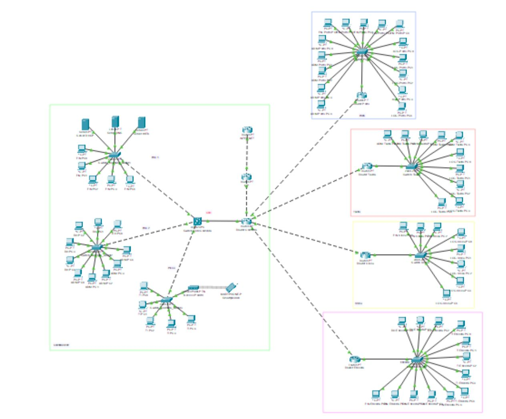

# PetroViseu - Enterprise Network Infrastructure

This project represents the design and implementation of a redundant, secure, and scalable corporate network for **PetroViseu**. Developed using **Cisco Packet Tracer**, the infrastructure connects a main Headquarters (Viseu) to a Regional Branch (Coimbra) via a simulated ISP/Cloud.

---

## Project Overview

The architecture is built upon a hierarchical model to ensure high availability and efficient data flow between departments. The network is segmented to optimize performance and enforce strict security policies between different business units.

### Network Topology

---

## Technical Implementation

### 1. Logical Segmentation (VLANs)
The network uses **VLANs** to isolate traffic and improve security. Each department resides in its own broadcast domain:
* **VLAN 10 (Administration):** Restricted access for executive management.
* **VLAN 20 (Accounting):** Secure access to financial systems.
* **VLAN 30 (HR):** Human Resources management.
* **VLAN 40 (Sales):** General sales department operations.
* **VLAN 50 (Tech/IT):** Technical support and network management.
* **VLAN 99 (Native):** Management and control traffic.

### 2. Routing & Protocols
* **OSPF (Open Shortest Path First):** Dynamic routing protocol implemented for fast convergence and scalability between branches.
* **Inter-VLAN Routing:** Configured using the **Router-on-a-Stick** method at the core.
* **NAT/PAT:** Network Address Translation implemented to allow internal private IPs to access the Internet/ISP.
* **STP (Spanning Tree Protocol):** Prevents Layer 2 loops in redundant switch links.

### 3. Essential Services (Server Farm)
The Viseu Headquarters hosts a centralized server farm providing:
* **DNS:** Resolution for internal and external domains.
* **HTTP/HTTPS:** The corporate PetroViseu web portal.
* **DHCP:** Automated IP assignment for all end-user devices.
* **Email & FTP:** For corporate communication and secure document storage.
* **SSH:** Secure remote management for network equipment.

---

## Security Measures
Security was implemented at multiple layers of the OSI model:
* **Access Control Lists (ACLs):** Configured to block unauthorized traffic between departments (e.g., blocking Sales from accessing Admin servers).
* **Port Security:** Implemented on access switches to prevent MAC-flooding attacks and unauthorized device connections.
* **Password Encryption:** All VTY lines, Console ports, and Enable modes are protected with `service password-encryption` and secret hashes.

---

## IP Addressing Schema
The project utilizes **VLSM (Variable Length Subnet Masking)** based on the `192.168.x.x` private range to minimize IP waste.

| Department | VLAN | Network Address | Mask |
| :--- | :--- | :--- | :--- |
| Administration | 10 | 192.168.10.0 | /27 |
| Accounting | 20 | 192.168.10.32 | /27 |
| Tech / IT | 50 | 192.168.10.64 | /28 |
| Servers | 40 | 192.168.10.128| /29 |

---

## How to Use
1.  **Software:** Ensure you have **Cisco Packet Tracer (v8.0+)** installed.
2.  **Open Project:** Download and open `ProjetoGrupo19.pkt`.
3.  **Wait for Convergence:** Allow 30–60 seconds for the Spanning Tree and OSPF to establish neighbor adjacencies (link lights will turn green).
4.  **Test:** * Ping from a PC in Viseu to a PC in Coimbra.
    * Open a PC browser and navigate to the corporate URL defined in the DNS.

---
